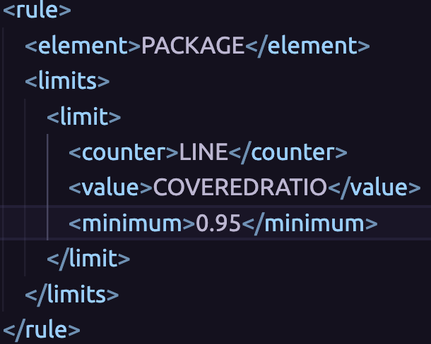
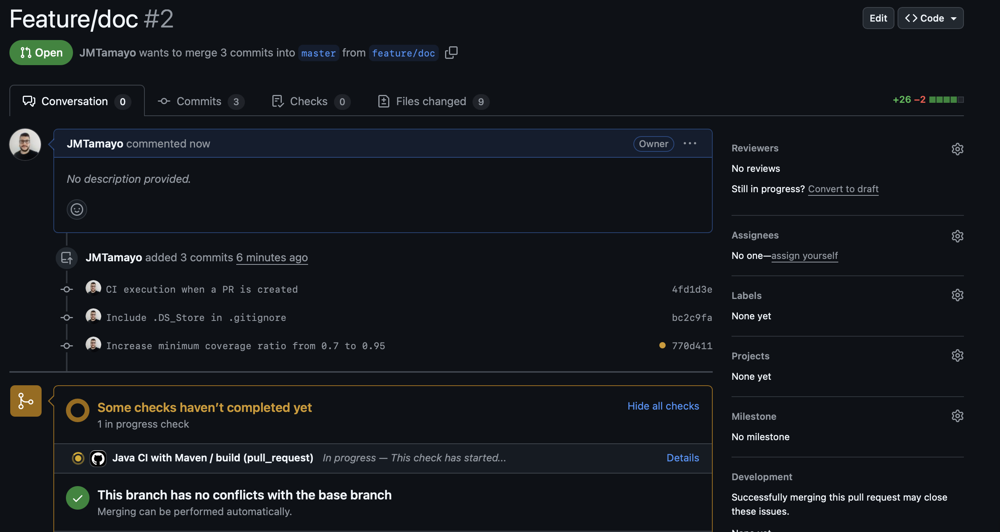
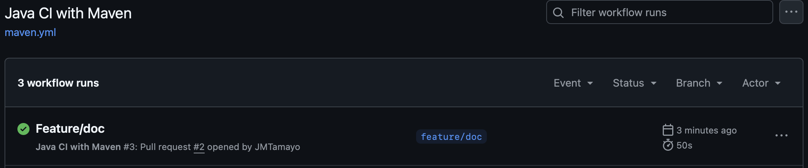
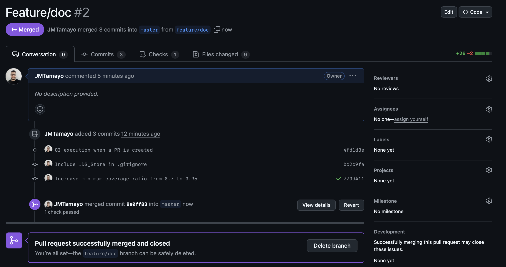
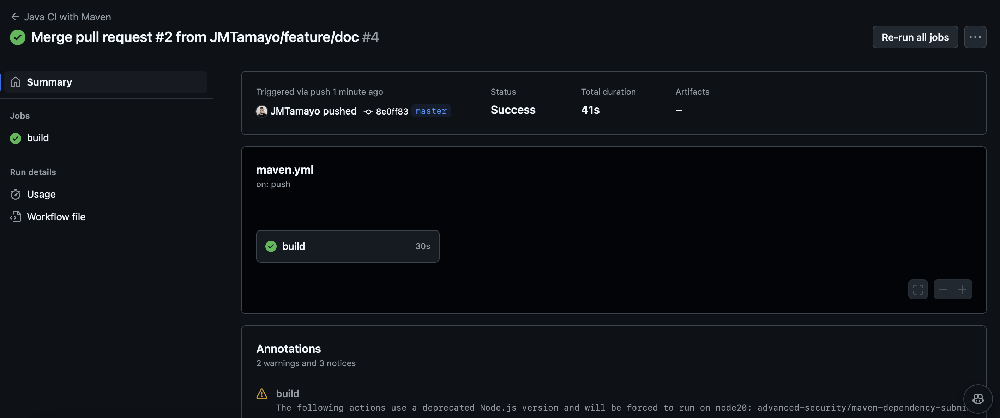

# PRÁCTICA GUIADA CI & CD

## 1. Gestión Del Repositorio
### 1.1 Fork:
Se realizó *fork* al repositorio [protobootapp](https://github.com/leonjaramillo/protobootapp).

### 1.2 Clone:
Se clonó repositorio en máquina local para la revisión estática del código, de las pruebas y de la gestión de dependencias.

## 2. Configuración de CI con GitHub Actions:
### 2.1 Workflow:
Se configuró una acción en GitHub a partir de lo especificado en el archivo de configuración **.github/workflows/maven.yml**

Este CI se ejecutará ante un *Pull Request* a la rama master o ante un nuevo commit en rama master.

### 2.2 Ejecución del CI ante PR:
Se realizó *Pull Request* a *master* con el objetivo de ejecutar el CI:

El CI se ejecutó ante la creación del *Pull Request* pero falló por novedades en la configuración de la acción:

Para corregir esta falla, se activó la opción *Dependency Graph*  en las opciones de seguridad del repositorio:

Se ejecutó nuevamente el job *Build* faillido:

Posteriormente, se incrementó el porcentaje mínimo de cóverage requerido de **0.7** a **0.95** y se realizó *Pull Request* a rama master de nuevo para ejecutar el CI:

El CI comienza su ejecución de forma automática con el *Pull Request* y se ejecuta de forma exitosa:

### 2.3 Ejecución del CI ante commit a master:
Se aprobó el *Pull Request* anterior con el fin de realizar merge a rama master. El CI se inició automáticamente y finalizó de forma exitosa:

