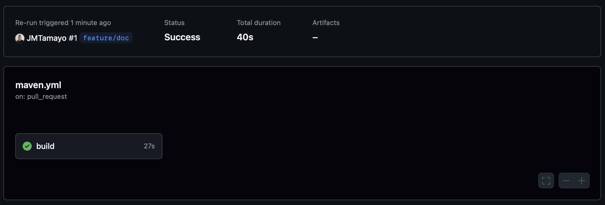
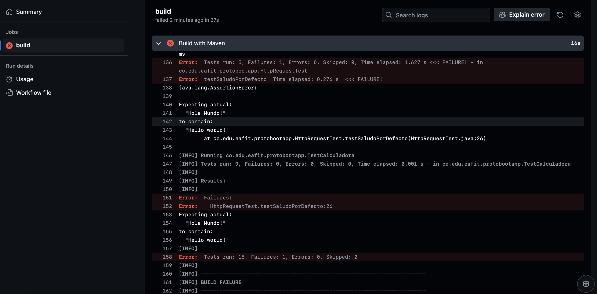
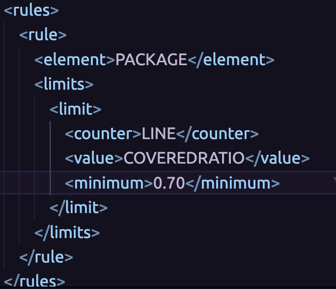
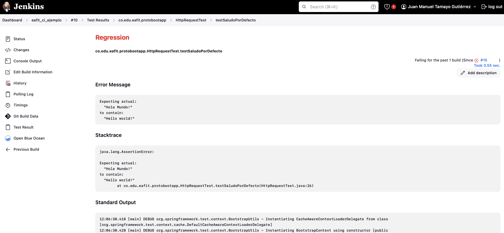

# PRÁCTICA GUIADA CI & CD

## 1. Gestión Del Repositorio
### 1.1 Fork:
Se realizó *fork* al repositorio [protobootapp](https://github.com/leonjaramillo/protobootapp).

### 1.2 Clone:
Se clonó repositorio en máquina local para la revisión estática del código, de las pruebas y de la gestión de dependencias.

## 2. CI con GitHub Actions:
### 2.1 Workflow:
Se configuró una acción en GitHub a partir de lo especificado en el archivo de configuración **.github/workflows/maven.yml**

Este CI se ejecutará ante un *Pull Request* a la rama master o ante un nuevo commit en rama master.

### 2.2 Ejecución del CI ante PR:
Se realizó *Pull Request* a *master* con el objetivo de ejecutar el CI:

El CI se ejecutó ante la creación del *Pull Request* pero falló por novedades en la configuración de la acción:

Para corregir esta falla, se activó la opción *Dependency Graph*  en las opciones de seguridad del repositorio:

Se ejecutó nuevamente el job *Build* faillido:

### 2.3 Ejecución del CI ante commit a master:
Se aprobó el *Pull Request* anterior con el fin de realizar merge a rama master. El CI se inició automáticamente y finalizó de forma exitosa:

### 2.4 Falla en CI por error en pruebas unitarias:
Se modificó prueba unitaria en función *cuadrado* de la clase *Calculadora* con el objetivo de provocar el fallo en el el CI de la siguiente manera:

Se evidenció que CI se ejecutó automáticamente y falló por resultados en pruebas unitarias:

### 2.5 Falla en CI por error en pruebas de integración:
Se modificó prueba unitaria en endpoint */hola*  con el objetivo de provocar el fallo en el el CI de la siguiente manera:

Se evidenció que CI se ejecutó automáticamente y falló por resultados en pruebas de integración:

### 2.6 Falla en CI por error en validación de formato:
Se modificó el pluggin del Checkstyle con el objetivo de generar falla en CI:

Se evidenció que CI se ejecutó automáticamente y falló por falla en la verificación del Checkstyle:

## 3. CI con Jenkins:
### 3.1 Configuración de entorno en Jenkins:
Se realizó la configuración de Jenkins de acuerdo a los siguientes pasos:

1. Se instaló Jenkins localmente usando *Homebrew* de acuerdo a lo mencionado en la documentación oficial: https://www.jenkins.io/download/lts/macos/
2. Se configuró Jenkins con las opciones recomendadas, se definió usuario administrador y puerto 8080 para su exposición.
3. Se configuraron los pluggins: *Warnings*, *JaCoCo* y *Blue Ocean*.
4. Se configuró *Maven* desde la opción *Install from Apache*. 

Posteriormente, se configuró un nuevo Job llamado *eafit_ci_ejemplo* con las siguientes características:

1. Se configuró nuevo Job con la opción *Freestile Project*.
2. Se activó la opción *Discard Old Builds*.
3. En la sección *Source Code Management*, se seleccionó la opción *Git* y la rama *master* como origen.
4. En la sección *Build Triggers*, se seleccionó *Poll SCM* con el parámetro "H/5 * * * * ".
5. En la sección *Build Steps*, se seleccionó *Invoke top-level Maven targets* y se definió el comando *compile tests install package*.
6. En la seccción *Post-build Actions*, se seleccionó *Publish JUnit test result report* con el parámetro "target/surefire-reports/*.xml"
7. Se añade la sección *Record compiled warnings and static analysis results* añadiendo las herramientas *Maven*, *Checkstyle*, *PMD* y *SpotBugs*.
8. Finalmente, se añade la sección *Record JaCoCo coverage report*.

### 3.2 Ejecución de CI ante cambios en master en parámetro Coverage Ratio:
En primer lugar, se incrementó el porcentaje mínimo de coverage requerido de **0.7** a **0.95**, se realizó y completó *Pull Request* a rama master de nuevo para ejecutar el CI. El CI falló dado el incremento en el coverage:

Se modificó porcentaje de coverage nuevamente de **0.95** a **0.7**, y posteriormente, se realizó commit a master para ejecutar CI en Jenkins. Se observa que el CI ejecutó de forma automática al detectar cambios en master en el mapeo que realiza cada 5 min:

A continuación se adjuntan imágenes de los resultados brindados por Jenkins en sus opciones predetermadas y en los pluggins configurados:

#### Pooling:

#### Changes:

#### Console:

#### Tests:

#### Coverage:

#### Maven Warnings:

#### PMD Warnings:

#### SpotBugs Warnings:

#### Blueocean:

### 3.3 Ejecución de CI ante cambios en master con falla en pruebas unitarias:
Se modificó prueba unitaria en función *cuadrado* de la clase *Calculadora* con el objetivo de provocar el fallo en el el CI de la siguiente manera:

Este commit corresponde al mismo usado en las pruebas con GitHub actions. 

Se evidenció que CI se ejecutó automáticamente y falló por resultados en pruebas unitarias:

### 3.4 Ejecución de CI ante cambios en master con falla en pruebas de integración:
Se modificó prueba unitaria en endpoint */hola*  con el objetivo de provocar el fallo en el el CI de la siguiente manera:

Este commit corresponde al mismo usado en las pruebas con GitHub actions. 

Se evidenció que CI se ejecutó automáticamente y falló por resultados en pruebas de integración:

### 3.5 Ejecución de CI ante cambios en master con falla en verificación de formato:
Se modificó el pluggin del Checkstyle con el objetivo de generar falla en CI:

Este commit corresponde al mismo usado en las pruebas con GitHub actions. 

Se evidenció que CI se ejecutó automáticamente y falló por falla en la verificación del Checkstyle:

